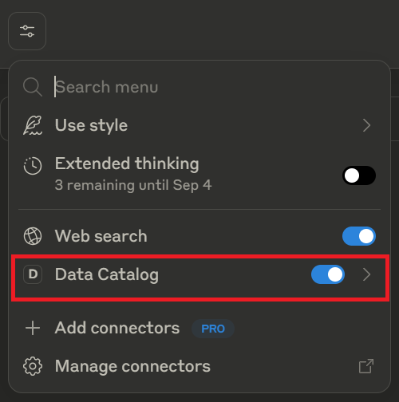
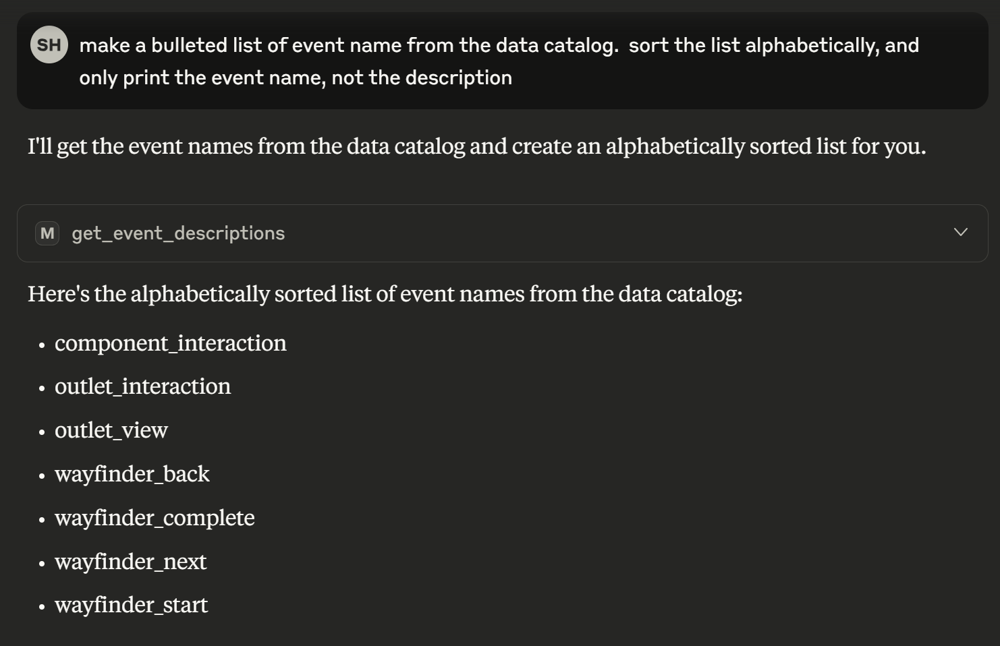
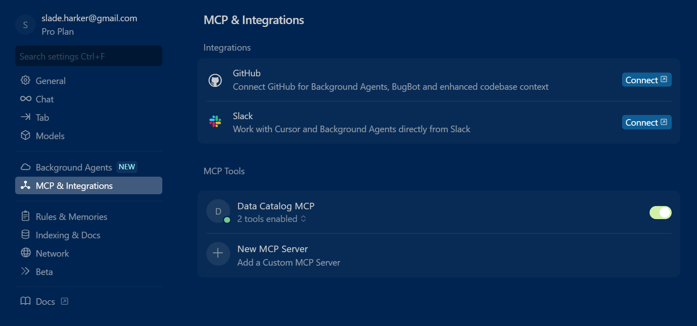

# Titanic MCP
Simple MCP server exploring using an MCP to provide tools to explore the titanic dataset.

Implements FastMCP and running on Docker.

## 1. Install linux, wsl2, and docker desktop

Follow these instructions up to installing Docker Desktop
https://liquid-interactive.atlassian.net/wiki/spaces/MAC/pages/4075618546/Local+environment+setup+guide

Also install Python 12 (12.0 or greater) if not already on your system
https://www.python.org/downloads/release/python-3120/

## 2. Build image and load into docker

In the directory of the solution on you machine run the following commands:
```
docker compose build --no-cache server 
docker compose up -d
```

## 3. Update Claude desktop
### 3.1 Setup MCP config
In Claude Desktop click File -> Settings, then select Developer
Click on Edit Config button
Put in the following config

```json
{
  "mcpServers": {
    "Titanic dataset": {
      "command": "npx",
      "args": [
        "-y",
        "mcp-remote@latest",
        "http://localhost:8006/mcp",
        "--transport",
        "http",
        "--allow-http",
        "--request-timeout",
        "60000"
      ]
    }
  }
}

```

### 3.2 Using a token (optional but recommended)
If you set `AUTH_TOKEN` in `.env`, append it to the MCP URL as a query param:

```json
{
  "mcpServers": {
    "Titanic dataset": {
      "command": "npx",
      "args": [
        "-y",
        "mcp-remote@latest",
        "http://localhost:8006/mcp?token=YOUR_TOKEN",
        "--transport",
        "http",
        "--allow-http",
        "--request-timeout",
        "60000"
      ]
    }
  }
}
```

### 3.3 Close Claude and the background process.


### 3.3 Restart Claude, the MCP server should show in the list




The model should be able to call it to complete requests




## 4. In Cursor

Go to Cursor Settings -> MCP & Integrations, under MCP Tools add a new MCP Server.

As for the Claude desktop config, if token authenication on the server has been set a token needs to be passed in the config, otherwise it can be omitted.

```json
{
  "mcpServers": {
    "Titanic dataset": {
      "command": "npx",
      "args": [
        "-y",
        "mcp-remote",
        "http://localhost:8006/mcp?token=YOUR_TOKEN",
        "--allow-http"
      ]
    }
  }
}
```



## Run locally

Install deps (recommended with `uv`):

```bash
uv pip install -r requirements.txt
```

Start the HTTP server:

```bash
uvicorn app:app --host 0.0.0.0 --port 8005 --log-level debug
```

The MCP HTTP endpoint will be served at `http://localhost:8005/`.


## Environment (.env)

Create a `.env` file (the app loads it automatically at startup):

```bash
cp .env.example .env
# then edit .env
```

- **LOG_DIR**: directory for application logs. Defaults to `shared_data/logs`. Override in `.env` if you want logs elsewhere.
- **AUTH_TOKEN**: if set, enables simple token auth. Requests must include either `Authorization: Bearer <token>` or `?token=<token>`.
- When using Docker Compose, `.env` is loaded via `env_file` and variables are available in the container.

### Authentication

If `AUTH_TOKEN` is set in `.env`, the HTTP server enforces a minimal token check:

- Send the header `Authorization: Bearer <token>`
- Or append a query parameter `?token=<token>`

If `AUTH_TOKEN` is not set or empty, authentication is disabled. Auth decisions are logged to `shared_data/logs/auth.log` by default.

Quick curl test (replace YOUR_TOKEN):

```bash
curl -i "http://localhost:8005/mcp?token=YOUR_TOKEN"
```


## References

- Official Python SDK for MCP server: `https://github.com/modelcontextprotocol/python-sdk`
